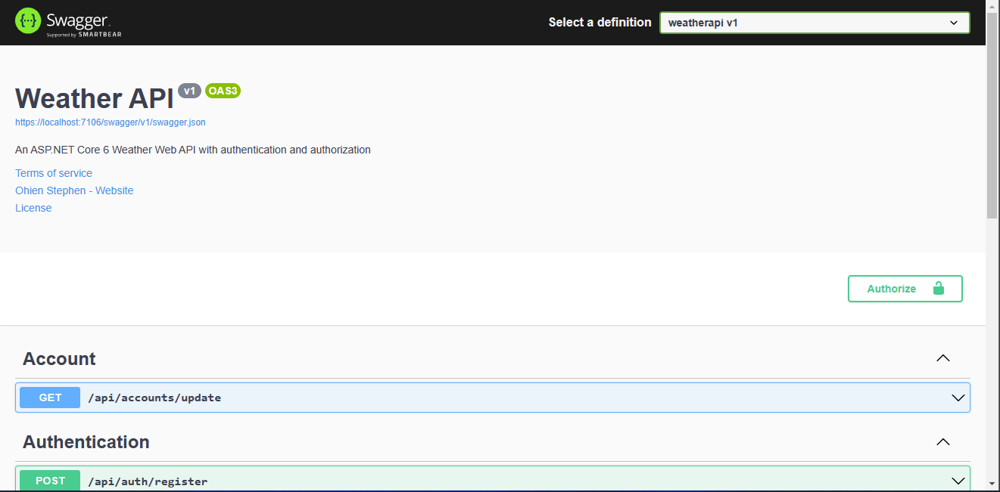

# Weather API - solution

An ASP.NET Core 6 Web API with authentication and authorization. This project uses Ntier Architecture.

## Table of contents

- [Overview](#overview)
  - [The challenge](#the-challenge)
  - [Screenshot](#screenshot)
  - [Links](#links)
- [My process](#my-process)
  - [Built with](#built-with)
- [Project setup](#project-setup)
- [Author](#author)
- [Acknowledgments](#acknowledgments)


## Overview

### The challenge

Create a simple weather RESTful API using .NET6, your project should include authentication and authorization.

### Screenshot



## My process

### Built with

- .NET 6
- ASP.NET Core
- C#


## Project setup
```
- change the database server connection string in the appsetting.json file
- update database: run 'update-database' in the package manager console.
```

### Compiles and hot-reloads for development
```
- dotnet run or just use the play button
```

## Author

- Website - [Ohien Stephen](https://https://ohienstephen.github.io)
- Frontend Mentor - [@Stephen0009](https://www.frontendmentor.io/profile/Stephen0009)
- Twitter - [@ohienstephen](https://www.twitter.com/ohienstephen)


## Acknowledgments

Ohien Stephen

**it was fun building!** 🚀